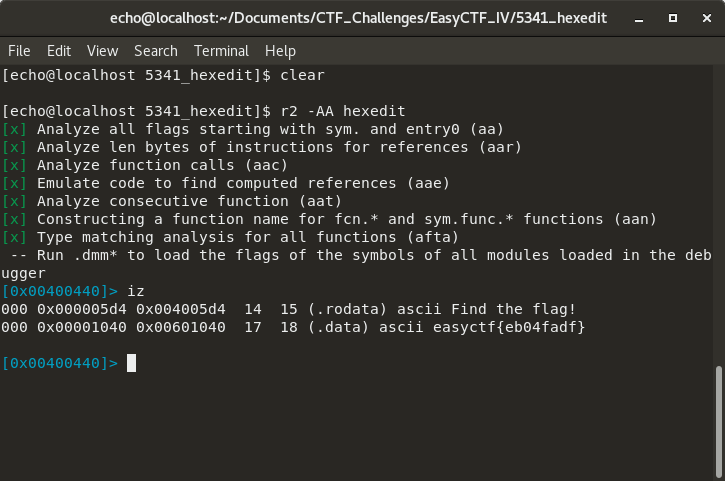

# Write-up - "hexedit" challenge - EasyCTF_IV

The name was a lie, we ain't editing any hex here !

Let's start with the basics, `file` should tell us what kind of file this is

``` shell
$ file hexedit 
hexedit: ELF 64-bit LSB executable, x86-64, version 1 (SYSV), dynamically linked,
interpreter /lib64/ld-linux-x86-64.so.2, for GNU/Linux 2.6.24,
BuildID[sha1]=be7897ed315b5c5a619013ec7c84c47a5278c9ee, not stripped
```

So this is an executable. The challenge was to find the flag in the file, so let's look for strings with [**radare2**](https://github.com/radare/radare2)

- `r2 -AA hexedit` -> Opens hexedit in radare2 and analyses it
- `iz` -> show strings in data sections of the binary

And sure enough:



