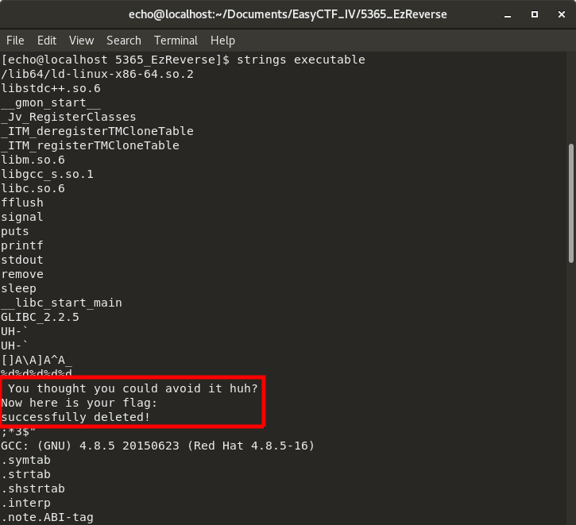
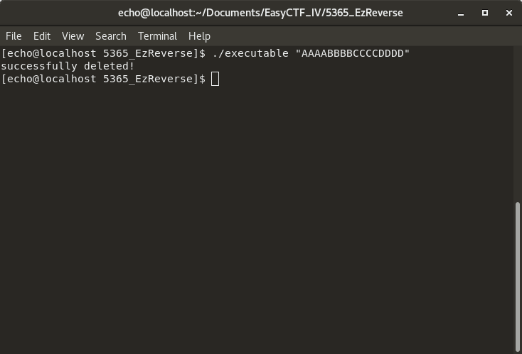
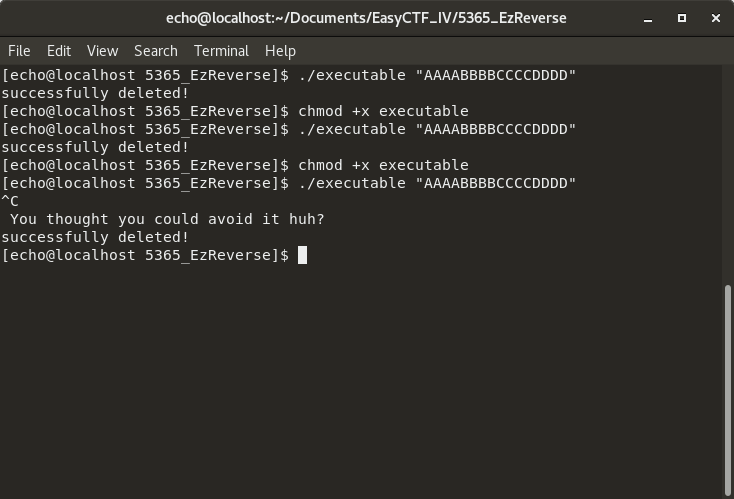
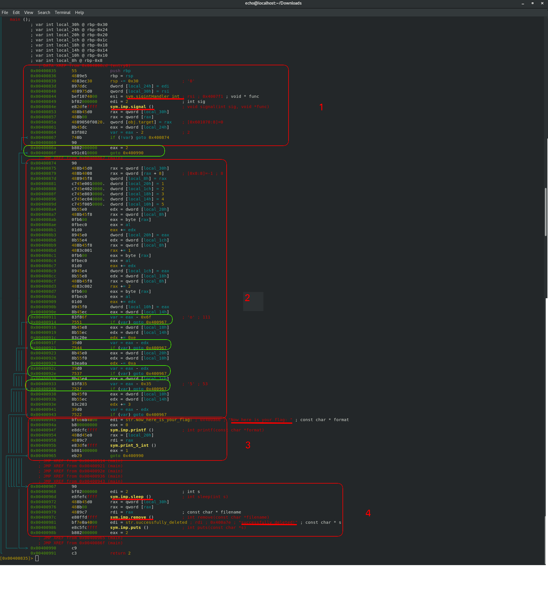
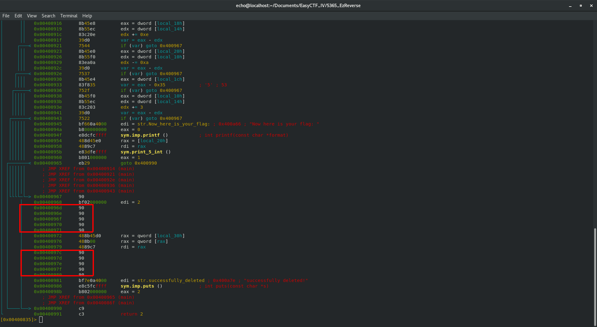
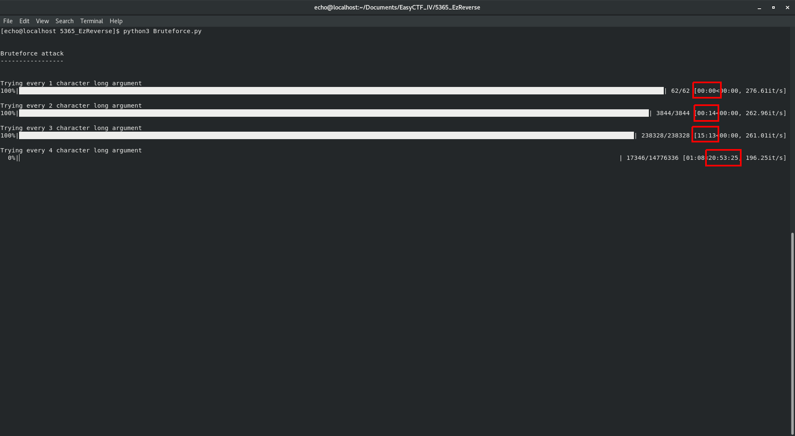
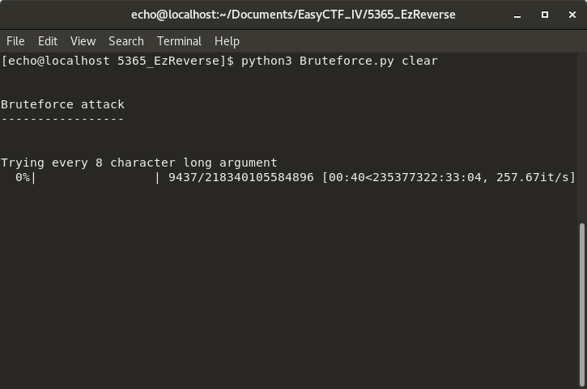
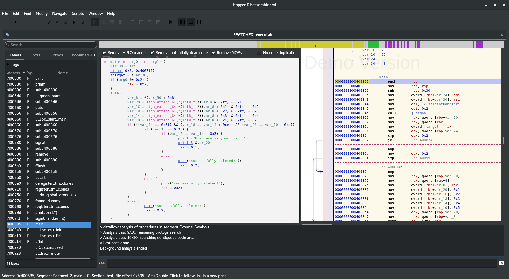
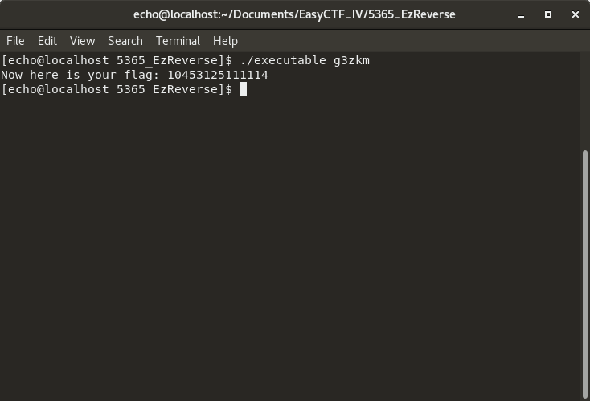
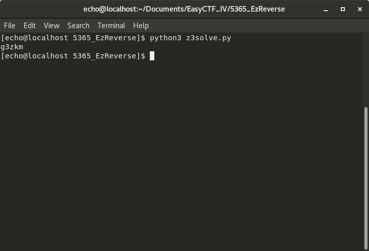

# Write-up - "EzReverse" challenge - EasyCTF_IV

## 1. Introduction

This is my first real challenge, and as such, it too me around 20h to solve. Instead of showing the *best* way to find the flag, I'll explain my thought process and show my mistakes, so that you, the reader, can learn from both. Since this is an *easy* challenge, this write-up is primarily targeted to newbies like me, although I'm sure a more experienced reverse engineers can get a laugh or two at my mistakes :).
Everything you need is on this repository, including my python scripts and a decompiled c file. Just download and enjoy!

### Table of content

1. [Introduction](#1-introduction)
   - [Table of content](#table-of-content)
   - [What You'll need to follow along](#what-youll-need-to-follow-along)
        
2. [First analysis, or the chmod conundrum](#2-first-analysis-or-the-chmod-conundrum)
   1. [`file`](#21-file)
   2. [`hexdump`](#22-hexdump)
   3. [`strings`](#23-strings)
   4. [**`chmod`**, or facepalm moment](#24-chmod-or-facepalm-moment)
   5. [First runs](#25-first-runs)
        
3. [What does this mess do?](#3-what-does-this-mess-do)
   1. [How to disassemble tho?](#31-how-to-disassemble-tho)
   2. [**radare2** FTW!](#32-radare2-ftw)
   3. [Now, you just have to understand...](#33-now-you-just-have-to-understand)
        
4. [Bruteforce baby!](#4-bruteforce-baby)
   1. [Patch Time](#41-patch-time)
   2. [Bruteforce Script](#42-bruteforce-script)
   3. [Bruteforce Attack](#43-bruteforce-attack)
        
5. [Let's try the smart way](#5-lets-try-the-smart-way)
   1. [Decompiling the binary](#51-decompiling-the-binary)
   2. [Cleanup and thoughts](#52-cleanup-and-thoughts)
   3. [Solving the mystery](#53-solving-the-mystery)
        
6. [Bonus : solving with z3](#6-bonus--solving-with-z3)

7. [Conclusion](#7-conclusion)

### What You'll need to follow along

- Some basic programing knowledge (an introductory course to C or/and Python should be enough)
- A basic understanding of Linux's CLI (ls, cd, echo... )
- A basic understanding of how hexadecimal works (If you are able to count to 0xff, you ar good)
- A basic understanding of how ASCII works (and an [ASCII table](https://fr.wikipedia.org/wiki/American_Standard_Code_for_Information_Interchange#/media/File:ASCII-Table-wide.svg))
- A linux Virtual Machine

Depending on your skill on each topic, a good day to a good week of googling should give you everything you need to tag along! Also, if you are new to this or simply a bit rusty, I can't recommend enough [this youtube playlist](https://www.youtube.com/watch?v=iyAyN3GFM7A&list=PLhixgUqwRTjxglIswKp9mpkfPNfHkzyeN) by [LiveOverflow](https://www.youtube.com/channel/UClcE-kVhqyiHCcjYwcpfj9w). Watch it to at least the 8th video, practice a little bit with the examples he gives and you'll have no problem understanding this write-up.

I started with a brand new Fedora 27 Virtual Machine, and not much else. I [downloaded the binary](https://github.com/KosBeg/ctf-writeups/raw/master/EasyCTF_IV/ez_rev/executable) from [CTFTime](https://ctftime.org/task/5365), noticed that a write-up already existed, promised myself to not read it and started right away.

## 2. First analysis, or the chmod conundrum

### 2.1 `file`

I thought I would first run the executable to see what it does. And I ran into the first problem : it wouldn't start:

``` shell
$ ./executable
bash: ./executable: Permission denied
```

So, after looking for solution online, I ran the [**`file`**](http://man7.org/linux/man-pages/man1/file.1.html) command, which will say what linux thinks this file is:

``` shell
$ file executable
executable: ELF 64-bit LSB executable, x86-64, version 1 (SYSV), dynamically linked, interpreter /lib64/ld-linux-x86-64.so.2, for GNU/Linux 2.6.32, BuildID[sha1]=eb7a47c52c657a17b5ae730826c4640de86b0dcf, not stripped
```

Mmmmh. My modest knowledge tells me that this should work ok...

### 2.2 `hexdump`

Fair enough, now let's [**`hexdump`**](http://man7.org/linux/man-pages/man1/hexdump.1.html) that bitch to see what it contains! `hexdump` is printing the actual zeros and ones that make the file, but converted in an hexadecimal format. Some numbers correspond to letters. The -C parameter shows those letters on the right.

``` shell
$ hexdump -C executable
00000000  7f 45 4c 46 02 01 01 00  00 00 00 00 00 00 00 00  |.ELF............|
00000010  02 00 3e 00 01 00 00 00  b0 06 40 00 00 00 00 00  |..>.......@.....|
00000020  40 00 00 00 00 00 00 00  60 1b 00 00 00 00 00 00  |@.......`.......|
00000030  00 00 00 00 40 00 38 00  09 00 40 00 1e 00 1b 00  |....@.8...@.....|
00000040  06 00 00 00 05 00 00 00  40 00 00 00 00 00 00 00  |........@.......|
00000050  40 00 40 00 00 00 00 00  40 00 40 00 00 00 00 00  |@.@.....@.@.....|
00000060  f8 01 00 00 00 00 00 00  f8 01 00 00 00 00 00 00  |................|
00000070  08 00 00 00 00 00 00 00  03 00 00 00 04 00 00 00  |................|
00000080  38 02 00 00 00 00 00 00  38 02 40 00 00 00 00 00  |8.......8.@.....|
00000090  38 02 40 00 00 00 00 00  1c 00 00 00 00 00 00 00  |8.@.............|
000000a0  1c 00 00 00 00 00 00 00  01 00 00 00 00 00 00 00  |................|
000000b0  01 00 00 00 05 00 00 00  00 00 00 00 00 00 00 00  |................|
000000c0  00 00 40 00 00 00 00 00  00 00 40 00 00 00 00 00  |..@.......@.....|
000000d0  0c 0c 00 00 00 00 00 00  0c 0c 00 00 00 00 00 00  |................|
000000e0  00 00 20 00 00 00 00 00  01 00 00 00 06 00 00 00  |.. .............|
000000f0  e0 0d 00 00 00 00 00 00  e0 0d 60 00 00 00 00 00  |..........`.....|
00000100  e0 0d 60 00 00 00 00 00  7c 02 00 00 00 00 00 00  |..`.....|.......|
00000110  98 02 00 00 00 00 00 00  00 00 20 00 00 00 00 00  |.......... .....|
00000120  02 00 00 00 06 00 00 00  f8 0d 00 00 00 00 00 00  |................|
00000130  f8 0d 60 00 00 00 00 00  f8 0d 60 00 00 00 00 00  |..`.......`.....|
00000140  00 02 00 00 00 00 00 00  00 02 00 00 00 00 00 00  |................|
00000150  08 00 00 00 00 00 00 00  04 00 00 00 04 00 00 00  |................|
00000160  54 02 00 00 00 00 00 00  54 02 40 00 00 00 00 00  |T.......T.@.....|
00000170  54 02 40 00 00 00 00 00  44 00 00 00 00 00 00 00  |T.@.....D.......|
00000180  44 00 00 00 00 00 00 00  04 00 00 00 00 00 00 00  |D...............|
00000190  50 e5 74 64 04 00 00 00  94 0a 00 00 00 00 00 00  |P.td............|
000001a0  94 0a 40 00 00 00 00 00  94 0a 40 00 00 00 00 00  |..@.......@.....|
000001b0  44 00 00 00 00 00 00 00  44 00 00 00 00 00 00 00  |D.......D.......|
000001c0  04 00 00 00 00 00 00 00  51 e5 74 64 06 00 00 00  |........Q.td....|
000001d0  00 00 00 00 00 00 00 00  00 00 00 00 00 00 00 00  |................|
*
000001f0  00 00 00 00 00 00 00 00  10 00 00 00 00 00 00 00  |................|
00000200  52 e5 74 64 04 00 00 00  e0 0d 00 00 00 00 00 00  |R.td............|
00000210  e0 0d 60 00 00 00 00 00  e0 0d 60 00 00 00 00 00  |..`.......`.....|
00000220  20 02 00 00 00 00 00 00  20 02 00 00 00 00 00 00  | ....... .......|
00000230  01 00 00 00 00 00 00 00  2f 6c 69 62 36 34 2f 6c  |......../lib64/l|
00000240  64 2d 6c 69 6e 75 78 2d  78 38 36 2d 36 34 2e 73  |d-linux-x86-64.s|
00000250  6f 2e 32 00 04 00 00 00  10 00 00 00 01 00 00 00  |o.2.............|
[...]
000021b0  60 10 60 00 00 00 00 00  5c 10 00 00 00 00 00 00  |`.`.....\.......|
000021c0  18 00 00 00 00 00 00 00  00 00 00 00 00 00 00 00  |................|
000021d0  10 00 00 00 00 00 00 00  00 00 00 00 00 00 00 00  |................|
000021e0  ff 00 00 00 01 00 00 00  30 00 00 00 00 00 00 00  |........0.......|
000021f0  00 00 00 00 00 00 00 00  5c 10 00 00 00 00 00 00  |........\.......|
00002200  2d 00 00 00 00 00 00 00  00 00 00 00 00 00 00 00  |-...............|
00002210  01 00 00 00 00 00 00 00  01 00 00 00 00 00 00 00  |................|
00002220  11 00 00 00 03 00 00 00  00 00 00 00 00 00 00 00  |................|
00002230  00 00 00 00 00 00 00 00  89 10 00 00 00 00 00 00  |................|
00002240  08 01 00 00 00 00 00 00  00 00 00 00 00 00 00 00  |................|
00002250  01 00 00 00 00 00 00 00  00 00 00 00 00 00 00 00  |................|
00002260  01 00 00 00 02 00 00 00  00 00 00 00 00 00 00 00  |................|
00002270  00 00 00 00 00 00 00 00  98 11 00 00 00 00 00 00  |................|
00002280  f0 06 00 00 00 00 00 00  1d 00 00 00 2d 00 00 00  |............-...|
00002290  08 00 00 00 00 00 00 00  18 00 00 00 00 00 00 00  |................|
000022a0  09 00 00 00 03 00 00 00  00 00 00 00 00 00 00 00  |................|
000022b0  00 00 00 00 00 00 00 00  88 18 00 00 00 00 00 00  |................|
000022c0  d8 02 00 00 00 00 00 00  00 00 00 00 00 00 00 00  |................|
000022d0  01 00 00 00 00 00 00 00  00 00 00 00 00 00 00 00  |................|
000022e0
```

Yeah, I may have overestimated myself a bit here, I have no idea WTF this is. Still, I see `ELF` and `ld-linux-x86-64.so.2`, which probably means that this file is a linux executable. So Y no work?

### 2.3 `strings`

Who know, maybe, since it's an easy challenge, the flag is coded in the binary, which is itself corrupted so no one can actually run it. The [**`strings`**](http://man7.org/linux/man-pages/man1/strings.1.html) command goes through the whole file and only outputs what it thinks a human could read. Let's try it!



Well that's what I call progress. Some interesting strings, obviously (even though it's no flag), but some function and other names I recognize from my C days :

- `puts()`
- `printf()`
- `stdout()`
- gcc...

So this program must be written in C (or maybe C++, I saw a `libstdc++` string too). I gotta say the "`You thought you could avoid it huh?`" has me a little scared... Now, if I could just run it, that would be great.

### 2.4 [**`chmod`**](http://man7.org/linux/man-pages/man2/chmod.2.html), or facepalm moment

On linux, you need to tell the system that the file is executable before running it. That is done with the `chmod +x nameOfTheFile` command. I am way too ashamed to tell you how long it took me to find/remember this...
Now, let's try to run it.

``` shell
$ chmod +x ./executable
$ ./executable
$
```

That was anticlimactic. Let's try to run it with an argument then:

### 2.5 First runs



That... is not a good sign... what was deleted? let's try to run it again:

``` shell
$ ./executable
bash: ./executable: No such file or directory
$ ls
$
```

This stupid program deleted itself ! Well, I guess I'll download it again.

I didn't try it at first, but later I found out that even if you press `CTRL + C` while it's deleting itself, you get the ""`You thought you could avoid it huh?`" string, and the program still deletes itself.



Still, it's an interesting behavior. It means that I cannot try a so called "bruteforce" attack, or I'll need to re download the binary after every failed attempt. I'll have to disassemble it and understand what it does to give it the argument it expects right away. I guess I'll take the challenge's hint :

> [**Objdump**](http://man7.org/linux/man-pages/man1/objdump.1.html) the executable and read some assembly

## 3. What does this mess do?

### 3.1 How to disassemble tho?

Disassembling a program means finding the instructions the processor follows. It is usually written in a stupidly ugly and hard to follow language: the assembly (asm for short). [**Objdump**](http://man7.org/linux/man-pages/man1/objdump.1.html) is a program that can do this disassembly for us, and show us the asm code of the executable. Since it's been hinted at, let's try it! (I'll only show the disassembly of the main function here, but the output is much longer)

``` shell
$ objdump -d executable

executable:     file format elf64-x86-64

[...]

0000000000400835 <main>:
  400835:	55                   	push   %rbp
  400836:	48 89 e5             	mov    %rsp,%rbp
  400839:	48 83 ec 30          	sub    $0x30,%rsp
  40083d:	89 7d dc             	mov    %edi,-0x24(%rbp)
  400840:	48 89 75 d0          	mov    %rsi,-0x30(%rbp)
  400844:	be f1 07 40 00       	mov    $0x4007f1,%esi
  400849:	bf 02 00 00 00       	mov    $0x2,%edi
  40084e:	e8 2d fe ff ff       	callq  400680 <signal@plt>
  400853:	48 8b 45 d0          	mov    -0x30(%rbp),%rax
  400857:	48 8b 00             	mov    (%rax),%rax
  40085a:	48 89 05 0f 08 20 00 	mov    %rax,0x20080f(%rip) # 601070 <target>
  400861:	8b 45 dc             	mov    -0x24(%rbp),%eax
  400864:	83 f8 02             	cmp    $0x2,%eax
  400867:	74 0b                	je     400874 <main+0x3f>
  400869:	90                   	nop
  40086a:	b8 02 00 00 00       	mov    $0x2,%eax
  40086f:	e9 1c 01 00 00       	jmpq   400990 <main+0x15b>
  400874:	90                   	nop
  400875:	48 8b 45 d0          	mov    -0x30(%rbp),%rax
  400879:	48 8b 40 08          	mov    0x8(%rax),%rax
  40087d:	48 89 45 f8          	mov    %rax,-0x8(%rbp)
  400881:	c7 45 e0 01 00 00 00 	movl   $0x1,-0x20(%rbp)
  400888:	c7 45 e4 02 00 00 00 	movl   $0x2,-0x1c(%rbp)
  40088f:	c7 45 e8 03 00 00 00 	movl   $0x3,-0x18(%rbp)
  400896:	c7 45 ec 04 00 00 00 	movl   $0x4,-0x14(%rbp)
  40089d:	c7 45 f0 05 00 00 00 	movl   $0x5,-0x10(%rbp)
  4008a4:	8b 55 e0             	mov    -0x20(%rbp),%edx
  4008a7:	48 8b 45 f8          	mov    -0x8(%rbp),%rax
  4008ab:	0f b6 00             	movzbl (%rax),%eax
  4008ae:	0f be c0             	movsbl %al,%eax
  4008b1:	01 d0                	add    %edx,%eax
  4008b3:	89 45 e0             	mov    %eax,-0x20(%rbp)
  4008b6:	8b 55 e4             	mov    -0x1c(%rbp),%edx
  4008b9:	48 8b 45 f8          	mov    -0x8(%rbp),%rax
  4008bd:	48 83 c0 01          	add    $0x1,%rax
  4008c1:	0f b6 00             	movzbl (%rax),%eax
  4008c4:	0f be c0             	movsbl %al,%eax
  4008c7:	01 d0                	add    %edx,%eax
  4008c9:	89 45 e4             	mov    %eax,-0x1c(%rbp)
  4008cc:	8b 55 e8             	mov    -0x18(%rbp),%edx
  4008cf:	48 8b 45 f8          	mov    -0x8(%rbp),%rax
  4008d3:	48 83 c0 02          	add    $0x2,%rax
  4008d7:	0f b6 00             	movzbl (%rax),%eax
  4008da:	0f be c0             	movsbl %al,%eax
  4008dd:	01 d0                	add    %edx,%eax
  4008df:	89 45 e8             	mov    %eax,-0x18(%rbp)
  4008e2:	8b 55 ec             	mov    -0x14(%rbp),%edx
  4008e5:	48 8b 45 f8          	mov    -0x8(%rbp),%rax
  4008e9:	48 83 c0 03          	add    $0x3,%rax
  4008ed:	0f b6 00             	movzbl (%rax),%eax
  4008f0:	0f be c0             	movsbl %al,%eax
  4008f3:	01 d0                	add    %edx,%eax
  4008f5:	89 45 ec             	mov    %eax,-0x14(%rbp)
  4008f8:	8b 55 f0             	mov    -0x10(%rbp),%edx
  4008fb:	48 8b 45 f8          	mov    -0x8(%rbp),%rax
  4008ff:	48 83 c0 04          	add    $0x4,%rax
  400903:	0f b6 00             	movzbl (%rax),%eax
  400906:	0f be c0             	movsbl %al,%eax
  400909:	01 d0                	add    %edx,%eax
  40090b:	89 45 f0             	mov    %eax,-0x10(%rbp)
  40090e:	8b 45 ec             	mov    -0x14(%rbp),%eax
  400911:	83 f8 6f             	cmp    $0x6f,%eax
  400914:	75 51                	jne    400967 <main+0x132>
  400916:	8b 45 e8             	mov    -0x18(%rbp),%eax
  400919:	8b 55 ec             	mov    -0x14(%rbp),%edx
  40091c:	83 c2 0e             	add    $0xe,%edx
  40091f:	39 d0                	cmp    %edx,%eax
  400921:	75 44                	jne    400967 <main+0x132>
  400923:	8b 45 e0             	mov    -0x20(%rbp),%eax
  400926:	8b 55 f0             	mov    -0x10(%rbp),%edx
  400929:	83 ea 0a             	sub    $0xa,%edx
  40092c:	39 d0                	cmp    %edx,%eax
  40092e:	75 37                	jne    400967 <main+0x132>
  400930:	8b 45 e4             	mov    -0x1c(%rbp),%eax
  400933:	83 f8 35             	cmp    $0x35,%eax
  400936:	75 2f                	jne    400967 <main+0x132>
  400938:	8b 45 f0             	mov    -0x10(%rbp),%eax
  40093b:	8b 55 ec             	mov    -0x14(%rbp),%edx
  40093e:	83 c2 03             	add    $0x3,%edx
  400941:	39 d0                	cmp    %edx,%eax
  400943:	75 22                	jne    400967 <main+0x132>
  400945:	bf 66 0a 40 00       	mov    $0x400a66,%edi
  40094a:	b8 00 00 00 00       	mov    $0x0,%eax
  40094f:	e8 dc fc ff ff       	callq  400630 <printf@plt>
  400954:	48 8d 45 e0          	lea    -0x20(%rbp),%rax
  400958:	48 89 c7             	mov    %rax,%rdi
  40095b:	e8 3d fe ff ff       	callq  40079d <_Z7print_5Pi>
  400960:	b8 01 00 00 00       	mov    $0x1,%eax
  400965:	eb 29                	jmp    400990 <main+0x15b>
  400967:	90                   	nop
  400968:	bf 02 00 00 00       	mov    $0x2,%edi
  40096d:	e8 fe fc ff ff       	callq  400670 <sleep@plt>
  400972:	48 8b 45 d0          	mov    -0x30(%rbp),%rax
  400976:	48 8b 00             	mov    (%rax),%rax
  400979:	48 89 c7             	mov    %rax,%rdi
  40097c:	e8 0f fd ff ff       	callq  400690 <remove@plt>
  400981:	bf 7e 0a 40 00       	mov    $0x400a7e,%edi
  400986:	e8 c5 fc ff ff       	callq  400650 <puts@plt>
  40098b:	b8 02 00 00 00       	mov    $0x2,%eax
  400990:	c9                   	leaveq
  400991:	c3                   	retq
  400992:	66 2e 0f 1f 84 00 00 	nopw   %cs:0x0(%rax,%rax,1)
  400999:	00 00 00
  40099c:	0f 1f 40 00          	nopl   0x0(%rax)

[...]

```

Nope. No way I'm reading this mess. I'll try to find an other way cause this is not doable at all.

### 3.2 [**radare2**](https://github.com/radare/radare2) FTW!

After much research on the internet, I ended up using [**radare2**](https://github.com/radare/radare2) to disassemble this binary. It's command line only, and the learning curve is a bit steep, but after a fair bit of messing around, I found those useful commands :

- `r2 fileName` -> Opens the file to disassemble
- `aaaa` -> *analyses* stuff. No idea but it's required.
- `e asm.pseudo=true` -> will change the asm code to make it more *readable*
- `afl` -> displays the list of functions radare2 found in the binary
- `s main` -> seek to the beginning of the main function
- `pdf`-> displays the asm code (and does **NOT** save it as a .pdf file :))

And I got this :



### 3.3 Now, you just have to understand...

The key here is not to try to understand each individual line of code, you won't succeed. Just try to understand how the code flows, what instructions are executed after which one, what path does the code take... After a bit of thinking, I highlighted every `goto` instructions (which are in fact `jump` instructions that radare2 modified for us to make it more clear. That's what the `ams.pseudo` is doing, among other things). you could also use the `VV` command to see a graph representation of the program flow, that may be more visual.

1. The beginning does some stuff, then, at the address `0x00400867`, checks if a value equals 2. In some cases (I'm not sure which one it is), it jumps to the end of the program and nothing happens. Well, that exactly the behavior we encountered at the beginning, when we ran the program without an argument. So this beginning just sets up some stuff, then checks if an argument has been passed. If not, then it jumps to the end and the program just stops.
2. Then, we get some pretty complex logic, and a series of jumps that all lead to the same place, namely `0x00400967`.
3. If we did not jump, we end up at `0x00400945`, which calls a "printf()" with a very enticing "`Now here is your flag:`" string. That means we passed all the checks, and if we end up there, we are golden. But if we fail any of the checks, we end up at `0x00400967`.
4. At this address, we have a call to the very ominous `sym.imp.remove()` function, as well as a call to the `puts()` function, with this string : "`successfully deleted!`". That's what happens when we give a random argument to the program! it deletes itself, then writes "successfully deleted!".

I now have a basic understanding of how this program behaves. I could try to read line by line the logic from `0x00400874` to `0x00400943`, and understand what the program wants as an input. But I'm really bad at asm and this looks like hard work. I have an other **(very bad)** idea.

## 4. Bruteforce baby!

Do you remember [why we could not try to pass random combinations of characters until we find the good one](###2.5-first-runs)? The program would delete itself. what if I could simply remove this instruction at `0x0040097c` that keeps deleting our binary file if we don't pass the checks, and just simply try (a lot of) random letters? Well that's exactly what I did, for the better and (_especially_) for the worse.

### 4.1 Patch Time

[**radare2**](https://github.com/radare/radare2) allows us to modify a few lines of asm and reassemble our code. Here are the commands :

- `r2 -w executable` -> open the binary with writing rights
- `s 0x0040097c` -> seek to the annoying call address
- `wao nop` -> replace the instruction here by a `nop` instruction, which does nothing.

Let's do the same for the sleep() instruction at `0x0040096d`. If the program doesn't wait a few seconds before it closes every time, our bruteforce attack will be much faster.

We can use the command `pdf` again to see how we changed the code :



Let's press `q` a few time to quit radare2 and try our new executable (which I renamed to "`PATCHED_executable`")

``` shell
$ ./PATCHED_executable "AAAABBBBCCCCDDDD"
successfully deleted!
[echo@localhost 5365_EzReverse]$ ls
executable      PATCHED_executable
```

And sure enough, it does says that it deletes stuff (since we didn't erase the call to `puts()` at `0x00400986`), but a quick `ls` shows us that this is just a lie. Now we just have to write a quick script that tries to pass every possible combinations of characters to the executable. That must be EZ, right? RIGHT?

### 4.2 Bruteforce Script

Here is my annotated python3 script. It shouldn't be too hard to follow. Many thanks to [CoryKramer](https://stackoverflow.com/users/2296458/corykramer) on [Stack Overflow](https://stackoverflow.com/) for is [answer](https://stackoverflow.com/a/40269815) on which my script is based. Also, thanks to the [tqdm](https://github.com/noamraph/tqdm) contributors, who saved me hours of wait (see below).

``` python
import subprocess
import string
from itertools import product
from sys import exit
from tqdm import tqdm # fancy progressbar stuff

guess = "" # string that will contain our argument
chars = string.ascii_letters + string.digits # dictionary of allowed characters
guessLength = 0 # length of the argument at the start. Increase to start with bigger password.

print("\n\nBruteforce attack")
print("-----------------\n")

while True:
    guessLength = guessLength + 1 # let's search with one more character (starting with a 1 character long argument)
    expectedGuesses = len(chars) ** guessLength # the amount of guess needed to try every combinations for guessLength characters

    print("Trying every arguments with length ", guessLength)

    with tqdm(total = expectedGuesses, mininterval = 1) as pbar: # fancy progressbar stuff
        for guess in product(chars, repeat=guessLength): # iterates all the possibles combinations for guessLength characters
            pbar.update(1)

            guess = ''.join(guess) # our new argument

            exec = subprocess.run(["./PATCHED_executable", guess], stdout=subprocess.PIPE) # try to run the executable with our argument
            output = exec.stdout.decode('utf-8')
            if not 'deleted!' in output:  # we analyse the output of the executable. If it doesn't say "successfully deleted!", then we are golden.
                print("ARGUMENT FOUND\n", guess, "\tOutput = ", output)
                exit()
            # else:     # that would print the current guess. commented for performance reasons.
            #     print(guess, "\tOutput = ", output[:-1])
```

Let's run it !

### 4.3 Bruteforce Attack



Uh oh... So I initially didn't have the progress bar telling me the remaining time. SO I thought everything would be ok. After quite a while I found [tqdm](https://github.com/noamraph/tqdm), which was super easy to implement in my code, and gave me an expected remaining time. Turns out it's way too much. Remember that at this point I have no idea how long the expected argument is. Let's say it is 8 characters long. Well, that would give me around 236,000,000 hours to wait to try every combinations. So roughly 27,000 years.



This kind of attack may be possible if I ran a compiled C script on a native OS, with a huge processor. But my crappy Python code running on a small 2 cores virtual machine won't cut it.

At this point, I'll need more information on the expected argument, to narrow down my bruteforce attack, or simply just find it first time, by understanding the disassembled code.

## 5. Let's try the smart way

After some hours spent staring at the asm code, I still have no idea what it does. Running it step by tep with [**radare2**](https://github.com/radare/radare2) didn't even help. So I decided to look into decompilers.

### 5.1 Decompiling the binary

Instead of *simply* disassembling the binary, some programs, called decompilers, try to recover the original source code. For some languages that aren't compiled, like Java, this is almost easy. But it nearly impossible for compiled languages, like C or C++, because the compiler (GCC in our case), messes the original code too much to produce the assembly. Still, some programs claim to be able to do it.

I know that [IDA Pro](https://www.hex-rays.com/products/ida/) offers a [state of the art C decompiler](https://www.hex-rays.com/products/decompiler/), but there is no way I can afford the (probably justified) 2629$ price tag. After a few failed attempts with [snowman](https://derevenets.com/) and [REC Studio](https://www.backerstreet.com/rec/rec.htm) which only gave me some gibberish, I ended up downloading [Hopper Disassembler v4](https://www.hopperapp.com/), with a free trial, and I can't recommend it enough. I'll probably buy a full license (99$) next pay day. Still, the free trial should be enough for you if you want to follow along with me.



So I start Hopper, `CTRL+SHIFT+O` to open the binary, and the asm magically shows up. I can seek to main on the left panel, and then press `ALT+ENTER` to get the C code. I'll copy it to my text editor, as well as the two functions above main, which I just now understand that they are part of the C source and not some random gibberish added by GCC, and concentrate.

### 5.2 Cleanup and thoughts

So we ended up with this :

``` c
int _Z7print_5Pi(int * arg0) {
    rax = printf("%d%d%d%d%d\n", *(int32_t *)arg0, *(int32_t *)(arg0 + 0x4), *(int32_t *)(arg0 + 0x8), *(int32_t *)(arg0 + 0xc), *(int32_t *)(arg0 + 0x10));
    return rax;
}

int _Z13sigintHandleri(int arg0) {
    signal(0x2, 0x4007f1);
    puts("\n You thought you could avoid it huh?");
    fflush(*stdout@@GLIBC_2.2.5);
    rax = *target;
    rax = remove(rax);
    return rax;
}

int main(int arg0, int arg1) {

        ; Variables:
        ;    var_8: -8
        ;    var_10: -16
        ;    var_14: -20
        ;    var_18: -24
        ;    var_1C: -28
        ;    var_20: -32
        ;    var_24: -36
        ;    var_30: -48


    var_30 = arg1;
    signal(0x2, 0x4007f1);
    *target = *var_30;
    if (arg0 != 0x2) {
            rax = 0x2;
    }
    else {
            var_8 = *(var_30 + 0x8);
            var_20 = sign_extend_64(*(int8_t *)var_8 & 0xff) + 0x1;
            var_1C = sign_extend_64(*(int8_t *)(var_8 + 0x1) & 0xff) + 0x2;
            var_18 = sign_extend_64(*(int8_t *)(var_8 + 0x2) & 0xff) + 0x3;
            var_14 = sign_extend_64(*(int8_t *)(var_8 + 0x3) & 0xff) + 0x4;
            var_10 = sign_extend_64(*(int8_t *)(var_8 + 0x4) & 0xff) + 0x5;
            if (((var_14 == 0x6f) && (var_18 == var_14 + 0xe)) && (var_20 == var_10 - 0xa)) {
                    if (var_1C == 0x35) {
                            if (var_10 == var_14 + 0x3) {
                                    printf("Now here is your flag: ");
                                    print_5(&var_20);
                                    rax = 0x1;
                            }
                            else {
                                    puts("successfully deleted!");
                                    rax = 0x2;
                            }
                    }
                    else {
                            puts("successfully deleted!");
                            rax = 0x2;
                    }
            }
            else {
                    puts("successfully deleted!");
                    rax = 0x2;
            }
    }
    return rax;
}
```

First of all, it's important to understand that this is no clean C code. GCC would throws thousands of errors while trying to parse that. But it's still way more understandable than the asm code, and that was the goal. So I'm not going to clean it up to make it pretty, or to compile it, I'm just trying to understand how it works.
Also, at this point, it my be worth looking into the other write-up for this challenge I mentioned in the beginning. As it happens, the author, [KosBeg](https://github.com/KosBeg) owns a IDA license, and you can see how he didn't have too much work to do to cleanup his [decompiled C code](https://github.com/KosBeg/ctf-writeups/tree/master/EasyCTF_IV/ez_rev). Well, mine is not as nice, but still workable, and I didn't watch his stuff because I really wanted to do it myself. So lets start the cleanup !

``` c
int PrintFlag(int* flagAddress) {
    return printf("%d%d%d%d%d\n", *flagAddress, *(flagAddress + 0x4), *(flagAddress + 0x8), *(flagAddress + 0xc), *(flagAddress + 0x10));
    // here we can see the order of the characters. 
    // The PrintFlag() function is called with the address (Stack Pointer - 32) line 51. So (Stack Pointer - 32) must be the first character
    // Then, it looks 4 bytes ahead for the second character, so (Stack Pointer - 32 + 4 = Stack Pointer - 28) must be the second character
    // And so on...
}


// This function is responsible for the behavior of the program when pressing CTRL+C
int SIGINTHandler(int argc) {
    signal(0x2, 0x4007f1);
    puts("\n You thought you could avoid it huh?");
    fflush(*stdout@@GLIBC_2.2.5);
    /* rax = *target;
    remove(rax); */ // Once again, this target memory is a mystery for me.
    return rax;
}


int main(int argc, char** argv) {

    // Variables declared in memory. I did choose sensible names, thanks to the PrintFlag function()
    userInput:  // Address = Stack Pointer -8
    char5:      // Address = Stack Pointer -16
    char4:      // Address = Stack Pointer -20
    char3:      // Address = Stack Pointer -24
    char2:      // Address = Stack Pointer -28
    char1:      // Address = Stack Pointer -32
    var_24:     // Address = Stack Pointer -36
    inputAddress:// Address = Stack Pointer -48

    int returnValue;
    inputAddress = argv;

    signal(2, *SIGINTHandler()); // signal needs a pointer to the function that is supposed to handle the signal, in our case SIGINTHandler()
    // *target = *inputAddress;  // No freakin idea what this target memory is for, so just comment out.
    if (argc != 2) { // No argument? then return 2
            returnValue = 2;
    }
    else {
            userInput = *(inputAddress + 0x8); // the user's input is at argv[1]
            char1 = userInput & 0xff) + 1;              // we only keep the last 8 bits of the first letter, and add 1 to it.
            char2 = (userInput + 0x1) & 0xff) + 2;      // same with every other letters
            char3 = (userInput + 0x2) & 0xff) + 3;
            char4 = (userInput + 0x3) & 0xff) + 4;
            char5 = (userInput + 0x4) & 0xff) + 5;
            if (((char4 == 0x6f) && (char3 == char4 + 0xe)) && (char1 == char5 - 0xa)) {
                    if (char2 == 0x35) {
                            if (char5 == char4 + 0x3) {
                                    printf("Now here is your flag: ");
                                    PrintFlag(&char1); // We send the address of char1, and it PrintFlag() will find the other characters from there.
                                    returnValue = 1;
                            }
                            else {
                                    sleep(0x2);
                                    remove(*inputAddress); // And that apparently is the line that deletes the binary file... somehow.
                                    puts("successfully deleted!");
                                    returnValue = 2;
                            }
                    }
                    else {
                            sleep(0x2);
                            remove(*inputAddress);
                            puts("successfully deleted!");
                            returnValue = 2;
                    }
            }
            else {
                    sleep(0x2);
                    remove(*inputAddress);
                    puts("successfully deleted!");
                    returnValue = 2;
            }
    }
    return returnValue;
}
```

Now that's more readable isn't it ? THe most interesting part happens just after the else statement. The program filters the argument, the adds 1 to the first character, 2 to the second, 3 to the third, 4 to the fourth, and 5 to the fifth. Then, it verifies some conditions, and if those are satisfied, it print the flag.

One thing to remember is that the characters in the conditions have been altered above. So char4 == 0x6f in fact checks if the fourth character we passed **plus four** equals 0x6f. Following this principle, we can write a list of constraints our argument must follow.

### 5.3 Solving the mystery

And here is what I ended up with :

``` shell
(char1 + 1) == (char5 + 5) - 0xa
(char2 + 2) == 0x35
(char3 + 3) == (char4 + 4) + 0xe
(char4 + 4) == 0x6f
(char5 + 5) == (char4 + 4) + 0x3
```

Well, now that's just some elementary school arithmetics. Just remember what is hexadecimal and what is decimal. Let's solve this step by step.

``` shell
char1 == char5 - 4              char1 == 0x6a
char2 == 0x33                   char2 == 0x33
char3 == char4 + 16     <=>     char3 == 0x7a
char4 == 0x6f - 4               char4 == 0x6b
char5 = char4 - 2               char5 == 0x6d
```

Now we just have to use our trusty [ASCII table](https://fr.wikipedia.org/wiki/American_Standard_Code_for_Information_Interchange#/media/File:ASCII-Table-wide.svg) to convert those hexadecimal numbers to characters. And we get the string "g3zkm". Let's try it!



And sure enough, we did it !

## 6. Bonus : solving with z3

I heard about how amazing z3 is, and I at this point, I did read [KosBeg](https://github.com/KosBeg)'s [write-up](https://github.com/KosBeg/ctf-writeups/tree/master/EasyCTF_IV/ez_rev), in which he did use z3 to solve the equation system. So I wanted to try it myself, without just copying his script. Turns out, our scripts are pretty similar, but I'll post mine here anyway :

``` python
import z3
import string

flag = ""

char1 = z3.Int("char1") # defines int variables in z3
char2 = z3.Int("char2")
char3 = z3.Int("char3")
char4 = z3.Int("char4")
char5 = z3.Int("char5")

s = z3.Solver()

s.add(char1 + 1 == char5 + 5 - 0xa) # define the equations in z3
s.add(char2 + 2 == 0x35)
s.add(char3 + 3 == char4 + 4 + 0xe)
s.add(char4 + 4 == 0x6f)
s.add(char5 + 5 == char4 + 4 + 0x3)

while s.check() != z3.sat: # we wait for z3 to do its thing
    if s.check == z3.unsat:
        print("No solution found")
    else:
        for k, v in s.statistics():
            print("%s : %s" % (k, v))


flag += chr(s.model()[char1].as_long()) # now we annoyingly have to convert the ints of z3 to characters
flag += chr(s.model()[char2].as_long()) # this took me way too long to find...
flag += chr(s.model()[char3].as_long())
flag += chr(s.model()[char4].as_long())
flag += chr(s.model()[char5].as_long())

print(flag) # nice !
```

And sure enough, that works too


## 7. Conclusion

Well, it's been a ride, hasn't it? I'm really proud of myself for solving this by myself, and I don't even regret my mistakes, because they all were great learning experiences. Also, now that the right software is on my computer and I (kinda) now how to use it, similar challenges should be super easy.
Anyway, I hope this was an interesting read, and I wish you the best in your future reverse engineering adventures.

I am also open to corrections and modifications. If needed, please contact me !

Have fun!


